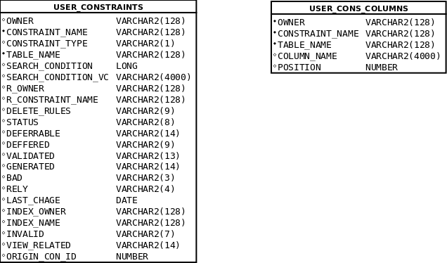

# Tutorium - Grundlagen Datenbanken - Blatt 6

## Vorbereitungen
* Für dieses Aufgabenblatt wird die SQL-Dump-Datei `01_tutorium.sql` benötigt, die sich im Verzeichnis `sql` befindet.
* Die SQL-Dump-Datei wird in SQL-Plus mittels `start <Dateipfad/zur/sql-dump-datei.sql>` in die Datenbank importiert.
* Beispiele
  * Linux `start ~/Tutorium.sql`
  * Windows `start C:\Users\max.mustermann\Desktop\Tutorium.sql`

## Datenbankmodell


## Data-Dictionary-Views


## Aufgaben

### Aufgabe 1
Wie heißt der Primary Key Contraint der Tabelle `VEHICLE` und für welche Spalten wurde er angelegt?

#### Lösung
```sql
select constraint_name
from user_constraints 
where constraint_type = 'P' and table_name = 'VEHICLE'
;
--oder:

SELECT ucc.constraint_name, ucc.column_name, ucc.position 
FROM user_cons_columns ucc
WHERE constraint_name IN(
	SELECT constraint_name
	FROM user_constraints uc
	WHERE uc.table_name LIKE 'VEHICLE'
	AND uc.constraint_type = 'P'
);
```

### Aufgabe 2
Für welche Spalte**n** der Tabelle `ACC_VEHIC` wurde ein Foreign Key angelegt und auf welche Spalte/n in welcher Tabelle wird er referenziert?

#### Lösung
```sql
SELECT a.table_name, a.column_name, a.constraint_name, c_pk.constraint_name 
  FROM all_cons_columns a
  JOIN all_constraints c ON a.owner = c.owner
                        AND a.constraint_name = c.constraint_name
  JOIN all_constraints c_pk ON c.r_owner = c_pk.owner
                           AND c.r_constraint_name = c_pk.constraint_name
 WHERE c.constraint_type = 'R'
   AND a.table_name = 'ACC_VEHIC'
   ;
   
   
--Oder:

COLUMN Typ FORMAT a1
COLUMN Constraint FORMAT a15
COLUMN H-Tabelle FORMAT a15
COLUMN R-Tabelle FORMAT a15
COLUMN Spalte FORMAT a15

SELECT uc.constraint_type AS "Typ", uc.comstraint_name AS "Constraint", uc.table_name AS "H-Tabelle", ucc.table_name AS"R-Tabelle", ucc.column_name "Spalte"
FROM user_constraints uc
LEFT JOIN user_cons_columns ucc ON(ucc.constraint_name = uc.R_constraint_name)
WHERE uc.table_name = 'ACC_VEHIC';   
   
```

### Aufgabe 3
Erstelle einen Check Constraint für die Tabelle `ACCOUNT`, dass der Wert der Spalte `U_DATE` nicht älter sein kann als `C_DATE`.

#### Lösung
```sql
ALTER TABLE account 
ADD CONSTRAINT co_date
CHECK( U_Date (to_date( 'dd.mm.yyyy')) > C_Date(to_date( 'dd.mm.yyyy'))
);
--Oder:

ALTER TABLE account 
ADD CONSTRAINT co_date
CHECK( U_Date >= C_Date
);

```

### Aufgabe 4
Erstelle einen Check Constraint der überprüft, ob der erste Buchstabe der Spalte `GAS_NAME` der Tabelle `GAS` groß geschrieben ist.(Regulärer Ausdruck!)

#### Lösung
```sql
ALTER TABLE GAS  
ADD CONSTRAINT u_gas_name
CHECK (REGEXP_LIKE (gas_name, '^[A-Z].*$'));

```

### Aufgabe 5
Erstelle einen Check Contraint, der überprüft, ob der Wert der Spalte `IDENTICATOR` der Tabelle `ACC_VEHIC` eins von diesen möglichen Fahrzeugkennzeichenmustern entspricht. Nutze Reguläre Ausdrücke.

+ B:AB:5000
+ TR:MP:1
+ Y:123456
+ THW:98765
+ MZG:XZ:96

#### Lösung
```sql
ALTER TABLE acc_vehic
ADD CONSTRAINT c_kennzeichen
CHECK (REGEXP_LIKE(identicator, '^[A-Z]{1,3}:([A-Z]{1,2}):[1-9][0-9]{0,3}|[1-9][0-9]{0,5}))$', 'c'))
;


```

### Aufgabe 6 - Wiederholung
Liste für alle Personen den Verbrauch an Kraftstoff auf (Missachte hier die unterschiedlichen Kraftstoffe). Dabei ist interessant, wie viel Liter die einzelne Person getankt hat und wie viel Euro sie für Kraftstoffe ausgegeben hat.

#### Lösung
```sql

COLUMN SURNAME FORMAT a15
COLUMN FORNAME FORMAT a15

SELECT ac.surname, ac.forename, 
	(
		SELECT SUM(r.price_l*r.liter*1+r.duty_amount)
		FROM receipt r
		WHERE account_id = ac.account_id
		GROUP BY r.account_id
	)"Ausgaben",
		(
			SELECT SUM(r.liter)
			FROM receipt r
			WHERE Account_id = ac.account_id
		)"Getankte Liter" 
FROM account ac;

```

### Aufgabe 7 - Wiederholung
Liste die Tankstellen absteigend sortiert nach der Kundenanzahl über alle Jahre.

#### Lösung
```sql
Deine Lösung
```

### Aufgabe 8 - Wiederholung
Erweitere das Datenbankmodell um ein Fahrtenbuch, sowie es Unternehmen für ihren Fuhrpark führen. Dabei ist relevant, welche Person an welchem Tag ab wie viel Uhr ein Fahrzeug für die Reise belegt, wie viele Kilometer zurück gelegt wurden und wann die Person das Fahrzeug wieder abgibt.

Berücksichtige bitte jegliche Constraints!

#### Lösung
```sql
CREATE TABLE LBOOK(
	LBOOK_ID NUMBER(38) NOT NULL,
	ACCOUNT_ID NUMBER(38) NOT NULL,
	ACC_VEHIC_ID NUMBER(38) NOT NULL,
	B_DATE DATE NOT NULL,
	KILOMETER NUMBER(7,3) NOT NULL,
	R_DATE DATE NOT NULL
);

ALTER TABLE LBOOK
ADD Constraint LBOOK_PK
PRIMARY KEY (LBOOK_ID);

ALTER TABLE LBOOK
ADD constraint buxdehude_fk
FOREIGN KEY (ACCOUNT_ID) REFERENCES ACCOUNT(ACCOUNT_ID);


ALTER TABLE LBOOK
ADD constraint trier_fk
FOREIGN KEY (ACC_VEHIC_ID) REFERENCES ACC_VEHIC(ACC_VEHIC_ID);

ALTER TABLE LBOOK
ADD CONSTRAINT check_date
CHECK (S_DATE >= B_DATE);

```


