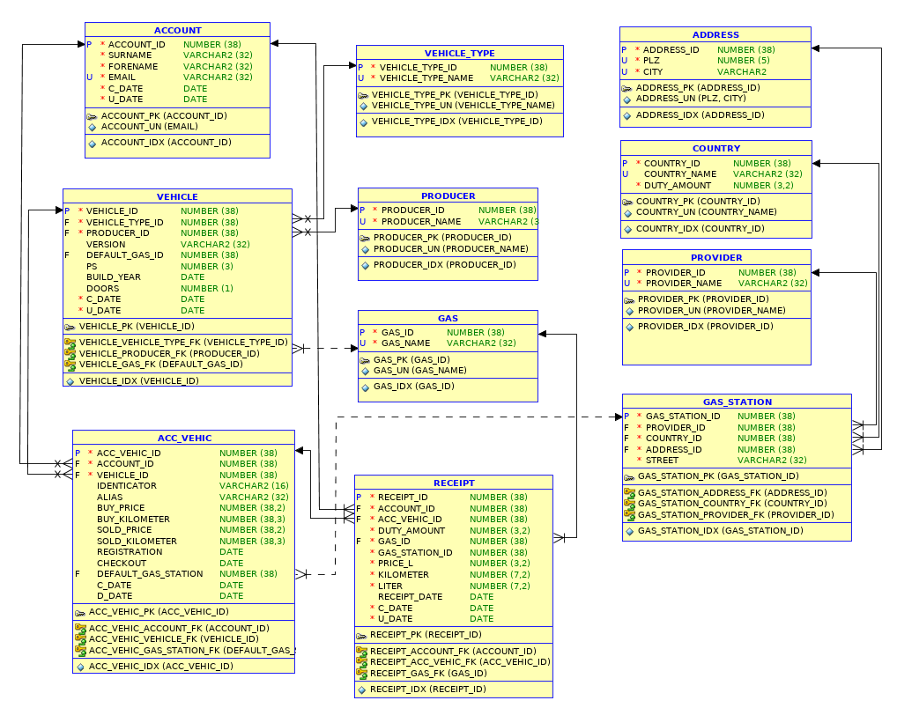

# Tutorium - Grundlagen Datenbanken - Blatt 8

## Vorbereitungen
* Für dieses Aufgabenblatt wird die SQL-Dump-Datei `tutorium.sql` benötigt, die sich im Verzeichnis `sql` befindet.
* Die SQL-Dump-Datei wird in SQL-Plus mittels `start <Dateipfad/zur/sql-dump-datei.sql>` in die Datenbank importiert.
* Beispiele
  * Linux `start ~/Tutorium.sql`
  * Windows `start C:\Users\max.mustermann\Desktop\Tutorium.sql`

## Datenbankmodell


### Aufgabe 1
Erstelle eine Prozedur, die das anlegen von Benutzern durch übergabe von Parametern ermöglicht.

#### Lösung
```sql


CREATE OR REPLACE PROCEDURE insert_user (surname_in IN VARCHAR2, forename_in IN VARCHAR2, email_in IN VARCHAR2)
AS

BEGIN 
	INSERT INTO account(account_id, surname, forename, email, c_date, u_date)
	VALUES ((SELECT MAX(account_id)+1 FROM Account),
		surname_in, forename_in, email_in, SYSDATE, SYSDATE	
		);
EXCEPTION
	WHEN NO_DATA_FOUND THEN
		DBMS_OUTPUT.PUT_LINE ('ES ist ein Fehler aufgetreten!');
	RAISE;
END;
/


```

### Aufgabe 2
Erstelle eine Prozedur, die das erstellen von Quittungen ermöglicht.  Fange entsprechende übergebene Parameter auf `NULL` oder ` ` ab und gebe eine Meldung aus. Ergänze eventuell Parameter die `NULL` sind mit Informationen die sich durch Abfragen abrufen lassen. Berücksichtige die Fehlerbehandlung und mögliche Constraints die gebrochen werden könnten!

#### Lösung
```sql
CREATE OR REPLACE PROCEDURE issue_recipe (
	accv_vehic_in IN NUMBER,
	duty_amount_in IN NUMBER,
	gas_station_id_in IN NUMBER,
	price_in IN NUMBER,
	liter_in IN NUMBER,
	re_date_in IN DATE)

AS
	accv_vehic_in acc_vehic.acc_vehic_id%TYPE;
	duty_amount_in country.duty_amount%TYPE;
	gas_station_id_in gas_station.gas_station_id%TYPE;
	price_in receipt.price_l%TYPE;
	liter_in receipt.liter%TYPE;
	re_date_in receipt.receipt_date%TYPE;

BEGIN
	IF ( TRUE <> REGEXP_LIKE (in_email, '[a-zA-Z0-9._%-]+@[a-zA-Z0-9._%-]+\.[a-zA-Z]{2,7}')) THEN
        RAISE_APPLICATION_ERROR(-20001, 'Die E-Mail entspricht nicht den Konditionen.');
	ELSE
        BEGIN
	            SELECT account_id INTO v_account_id
	            FROM account
	            WHERE email = in_email;
	        EXCEPTION
	            WHEN NO_DATA_FOUND THEN
	                RAISE_APPLICATION_ERROR(-20001, 'Es konnte kein Benutzer mit der E-Mail Adresse ' || in_email || ' gefunden werden!');
	        END;
	END IF;
	
	BEGIN
	        SELECT acc_vehic_id INTO v_accv_id
	        FROM acc_vehic
	        WHERE acc_vehic_id = in_accv_id;
	EXCEPTION
	        WHEN NO_DATA_FOUND THEN
	            RAISE_APPLICATION_ERROR(-20001, 'Es konnte kein Fahrzeug mit der ACC_VEHIC_ID ' || in_accv_id || ' gefunden werden!');
	END;

	BEGIN
        SELECT gas_station_id INTO v_gas_station_id
        FROM gas_station
		WHERE gas_station_id = in_gas_station_id;
	EXCEPTION
        WHEN NO_DATA_FOUND THEN
	            RAISE_APPLICATION_ERROR(-20001, 'Es konnte keine Tankstelle mit der GAS_STATION_ID ' || in_gas_station_id || ' gefunden werden!');
	END;
	
	
		

EXCEPTION
	WHEN NO_DATA_FOUND THEN
		DBMS_OUTPUT.PUT_LINE ('ES ist ein Fehler aufgetreten!');
	RAISE;

END;
/	

```

