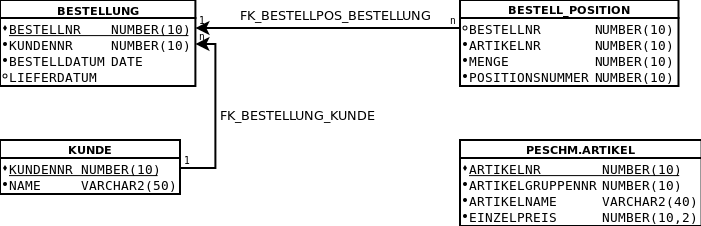

# Tutorium - Grundlagen Datenbanken - Blatt 12

## Vorbereitung
Der [SQL-Dump](./sql/03_schema_altklausur.sql) des Datenbankmodells befindet sich im Verzeichnis `sql`.

## Datenbankmodell


## Aufgaben
Diese Aufgaben lehnen sich an eine Altklausur an. Jede Aufgabe gibt 5 Punkte. 1 Punkt entspricht einer Bearbeitungszeit von 1 Minute. Bei 13 Aufgaben entspricht das 65 Minuten. Versuchen Sie die 13 Aufgaben binnen 65 Minuten zu lösen.

### Aufgabe 1
Sie haben ein `SELECT`-Recht auf die Tabelle `ARTIKEL` im Schema `peschm` - Warum?

#### Lösung
```sql
SELECT table_schema, table_name, privilege
FROM all_tab_privs
WHERE REGEXP_LIKE(table_schema, 'peschm', 'i')
AND REGEXP_LIKE(table_name, 'artikel', 'i')
AND grantee IN(
'PESCHM',(SELECT granted_role 
	FROM user_role_privs),
	'PUBLIC'
);


```

### Aufgabe 2
Legen Sie ein Synonym mit Namen `ARTIKEL` für die Tabelle an aus Aufgabe 1 und bestimmen Sie die Anzahl der Artikel in dieser Tabelle.

#### Lösung
```sql
--Synonyme

CREATE SYNONYM artikel
FROM peschm.artikel;

--gezählte Artikel

COUNT(*)
FROM artikel;

```

### Aufgabe 3a
Ergänzen Sie das Skript um ein geeignetes `CREATE TABLE` Statement für die Tabelle `BESTELLUNG`, das zur obigen Grafik passt, einschließlich `PRIMARY KEY`. Die `FOREIGN KEYS`  werden in Aufgabe 3b angelegt. Starten Sie anschließend das Skript.

#### Lösung
```sql

-- siehe dump Datei

```

### Aufgabe 3b
Implementieren Sie alle Foreign key Konstrukte, die in der obigen Grafik dargestellt sind mit geeigneten delete rules.

#### Lösung
```sql
ALTER TABLE bestellung
ADD CONSTRAINT "FK_BESTELLUNG_KUNDE"
	FOREIGN KEY(kundennr)
	REFERNCES kunde(kundennr)
	ON DELETE CASCADE;

ALTER TABLE bestell_position
ADD CONSTRAINT "FK_BESTELLPOS_BESTELLUNG"
	FOREIGN KEY (bestellnr)
	REFERENCES bestellung(bestellnr)
	ON DELETE CASCADE;

```

### Aufgabe 4
Überprüfen Sie mit einem SQL Statement, ob alle Artikelnr in `BESTELL_POSITION` in der Tabelle DWH.ARTIKEL vorkommen.

#### Lösung
```sql
SELECT DISTINCT artikelnr
FROM bestell_position
WHERE artikelnr NOT IN
(SELECT artikelnr FROM artikel);


```

### Aufgabe 5
Stellen Sie sicher, dass das Attribut `MENGE` in der Tabelle `BESTELL_POSITION` nur positive Zahlen kleiner als `10` enthalten kann.

#### Lösun
```sql
ALTER TABLE BESTELLPOSITION
ADD CONSTRAINT C_MENGE
CHECK (menge > 0 AND menge < 10);

```

### Aufgabe 6
Schreiben Sie eine `STORED PROCEDURE` mit geeigneter Fehlerbehandlung, die als Parameter eine Bestellnummer erwartet und den Gesamtwert über alle Bestellpositionen der Bestellung ausgibt. Die Einzelpreise befinden sich in der Tabelle `PESCHM.ARTIKEL` oder ihrem zuvor angelegtem Synonym.

#### Lösung
```sql
SET SERVEROUTPUT ON 
create OR replace procedure get_gesamtwert(bestellnr_in IN number) 
AS
    v_preis artikel.einzelpreis%type;

BEGIN    
        select SUM(a.einzelpreis * bp.menge) INTO v_preis
        from bestell_position bp
	INNER JOIN artikel a ON(a.artikelnr = bp.artikelnr)
	WHERE bp.bestellnr = bestellnr_in; 
        
IF(v_preis IS NULL) THEN
	raise_application_error(-20021, 'Es wurde keine Bestellung gefunden: ' );
    END IF;
  
 dbms_output.put_line('Gesamtpreis: ' || v_preis)

EXCEPTION
    when others then
        raise_application_error(-20020, 'Error: ' || substr(1, 80, sqlerrm));
END;
/
```

### Aufgabe 7
Stellen Sie sicher, dass eine neue Bestellung in die Tabelle `BESTELLUNG` nur eingetragen werden kann, indem automatisch der nächste Wert aus einer Sequence `BESTELLUNG_SEQ` als `BESTELLNR` genommen wird, die Sie auch noch anlegen müssen mit Startwert `30000` und increment `10`!

#### Lösung
```sql
CREATE SEQUENCE bestellung_seq
START WITH 30000
INCREMENT BY 10;


CREATE OR REPLACE TRIGGER bestellung_biu
BEFORE INSERT OR UPDATE OF bestellnr ON bestellung
FOR EACH ROW
DECLARE

BEGIN 
IF INSERTING THEN
  :NEW.bestellnr := bestellung_seq.NEXTVAL;
END IF;
	
IF UPDATING('bestellnr') THEN
  RAISE_APPLICATION_ERROR(-20001, 'Die Bestellnr darf nicht verändert oder frei gewählt werden!');
END IF;
END;
/
```

### Aufgabe 8
Beantworten Sie die folgenden Aufgaben mit einem SQL-Befehl:

#### Aufgabe 8a
Geben Sie alle Kunden aus mit der Anzahl ihrer Bestellungen!

#### Lösung
```sql
SELECT k.name, count(b.bestellnr)
FROM kunde k
INNER JOIN bestellung b ON (k.kundennr = b.kundennr)
GROUP BY k.name;


```

#### Aufgabe 8b
Tragen Sie in der Bestellung mit Nr `19366` ein Lieferdatum ein, das neun Tage in der Zukunft liegt von heute aus gesehen!

#### Lösung
```sql

UPDATE bestellung
SET lieferdatum = SYSDATE + INTERVAL '9' DAY
WHERE bestellnr = 19366;


```

#### Aufgabe 8c
Welcher Kunde hat am meisten Bestellungen aufgegeben?

#### Lösung
```sql
SELECT kundennr 
FROM kunde 
GROUP BY kundennr
HAVING COUNT (*) = (
	SELECT MAX(count(bestellnr))
	FROM Kunde
	LEFT JOIN bestellung ON (bestellung.kundennr = kunde.kundennr)
	GROUP BY kunde.kundennr
)
;

```

#### Aufgabe 8d
Geben Sie Kunden aus, die keine Bestellung aufgegeben haben!

#### Lösung
```sql
SELECT kundennr, name
FROM kunde
WHERE kundennr NOT IN (Select kundennr FROM bestellung);


```

#### Aufgabe 8e
Welcher Kunde hat den größten Bestellwert generiert?

#### Lösung
```sql
SELECT k.kundennr, k.name
FROM kunde k
WHERE k.kundennr IN(
	SELECT b.kundennr
	FROM bestellung b
		INNER JOIN bestell_position bp ON (bp.bestellnr = b.bestellnr)
		INNER JOIN Artikel a ON (a.artikelnr = bp.artikelnr)
	HAVING SUM(bp.menge * a.einzelpreis) = (
		SELECT MAX(SUM(bp.menge * a.einzelpreis))
		FROM BESTELLUNG b
			INNER JOIN bestell_position bp ON (bp.bestellnr = b.bestellnr)
			INNER JOIN artikel a ON (bp.artikelnr = a.artikelnr)
		GROUP BY b.bestellnr
	)
)
;


```

